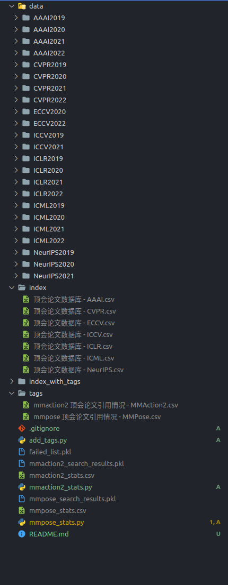

# Paper-stats

## Data Organization

Please download and organize data as the following:

- `data`: paper PDF files
- `index`: Raw paper list in csv files
- `stats`: Retrived paper information in csv files (generated by `mmpose_stats.py` and `mmaction2_stats.py`)
- `index_with_tags`: Paper list with area/codebase tags in csv files (generated by `add_tags.py`)



## Usage

### Search related papers by keywords

```bash
# search papers on pose estimation
python mmpose_stats.py
# search papers on video understanding
python mmaction2_stats.py
```

### Add Tags

```bash
# generate paper index with tags
python add_tags.py
```

### 多机多进程

```shell
srun -p mm_model -n 1024 -c 1 --ntasks-per-node 64 python rank.py
```